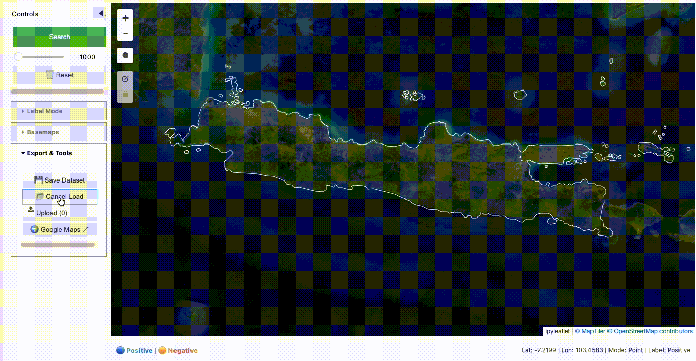

# Evaluate Your Geospatial Models Vibes

Yeah benchmarks are cool and stuff, but how are your model's vibes? With this tooling you'll hopefully be able to see via the magic of search/retrieval from your laptop!

This repo was originally inspired by the [Earth Genome notebook tooling](https://github.com/earth-genome/ei-notebook). GeoVibes now uses Google's satellite foundation model embeddings accessed through Google Earth Engine, providing high-quality 64-dimensional embeddings for satellite imagery analysis.

**Highly experimental. This repo is not production-grade code.**

## Quick Start

### Web Application (Recommended)

GeoVibes runs as a standalone web application with an interactive mapping interface:

```bash
# Install dependencies
pip install -r requirements.txt

# Run with configuration file (recommended)
python run.py --config config.yaml

# Or run with individual parameters
python run.py --duckdb-directory ./local_databases --boundary geometries/alabama.geojson

# Run with custom port and disable auto-browser opening
python run.py --config config.yaml --port 8080 --no-browser
```

The application will automatically:

1. Start a web server using [Voila](https://github.com/voila-dashboards/voila)
2. Open your default browser to the GeoVibes interface
3. Provide interactive mapping with similarity search capabilities

### Features

-   **Multiple basemaps**: MapTiler satellite, Sentinel-2 RGB/NDVI/NDWI composites, Google Hybrid maps
-   **Flexible labeling**: Point-click and polygon selection for positive/negative examples
-   **Iterative search**: Query vector updates with each labeling iteration using `2×positive_avg - negative_avg`
-   **Save/load**: Persist labeled datasets as GeoJSON for continued refinement
-   **Memory efficient**: Cached embeddings and chunked database queries for large regions

#### Interactive Search Examples

**Label a point and search**  
Start your search by picking a point for which you would like to find similar ones in your area, then click Search


**Polygon Labeling**  
Search is iterative: positives get added to your query vector and negatives get subtracted. Use polygon labeling mode for bulk positive/negative selection.


**Load Previous Datasets**  
Save your search results as GeoJSON and reload them to continue searching.


## Configuration

### YAML Configuration (Recommended)

Create a `config.yaml` file to configure GeoVibes:

```yaml
# Required: Path to directory containing DuckDB database files
duckdb_directory: ./local_databases

# Required: Boundary geometry file (GeoJSON) defining your area of interest
boundary_path: geometries/alabama.geojson

# Required: Date range for imagery analysis
start_date: "2024-01-01"
end_date: "2025-01-01"

# Optional: Google Cloud Platform project ID (for Earth Engine basemaps)
gcp_project: "your-gcp-project-id"

# Optional: Enable verbose logging (default: false)
verbose: true

# Optional: MapTiler API key for satellite basemaps (can also use .env file)
maptiler_api_key: "your-maptiler-api-key"
```

### Environment Variables

Create a `.env` file in the repository root for sensitive configuration:

```env
# Required for MapTiler satellite basemaps
MAPTILER_API_KEY=your_maptiler_api_key_here

# Optional: For Google Cloud Storage database access
GCS_ACCESS_KEY_ID=your_access_key_here
GCS_SECRET_ACCESS_KEY=your_secret_key_here
```

### Command Line Options

All configuration options can be provided via command line:

```bash
python run.py \
  --duckdb-directory ./local_databases \
  --boundary geometries/alabama.geojson \
  --start-date 2024-01-01 \
  --end-date 2025-01-01 \
  --gcp-project your-gcp-project-id \
  --port 8080 \
  --no-browser \
  --verbose
```

Run `python run.py --help` for all available options.

## Architecture

The GeoVibes system is designed for efficient large-scale geospatial similarity search. The core of the system is a DuckDB database that stores vector embeddings and their corresponding geometries.

The database is built using the script in `src/database.py` and is optimized for performance with the following features:

-   **Vector Similarity Search (VSS):** It uses DuckDB's `vss` extension for efficient similarity search on high-dimensional vector embeddings.
-   **HNSW Index:** A Hierarchical Navigable Small World (HNSW) index is created on the embeddings for fast approximate nearest neighbor search. This is ideal for finding "similar" vibes quickly.
-   **R-Tree Index:** A spatial index (R-Tree) is built on the geometries of the embeddings. This allows for fast spatial querying, like finding all points within a drawn polygon.

This combination of vector and spatial indexing allows GeoVibes to perform complex queries that combine both content-based similarity and geographic location.

## Prerequisites

### 1. Python Environment

Create and activate a conda environment:

```bash
mamba create -n geovibes python=3.12 -y
mamba activate geovibes
mamba install -c conda-forge --file ./requirements.txt -y
```

### 2. Database Access

You can either download pre-built databases or create your own:

**Option 1: Download pre-built databases**

```bash
mkdir -p local_databases && gsutil -m cp "gs://geovibes/databases/google/*.db" local_databases/
```

**Option 2: Build your own databases** (see [Generate Embeddings](#generate-embeddings) section)

### 3. Earth Engine Authentication (Optional - for NDVI/NDWI basemaps)

Earth Engine authentication is **completely optional**. GeoVibes works perfectly without it!

If you want to use NDVI and NDWI basemaps, you'll need to authenticate with Google Earth Engine:

```bash
# Install the Earth Engine API (if not already installed)
mamba install -c conda-forge earthengine-api -y

# Authenticate with Earth Engine
earthengine authenticate
```

Follow the authentication flow in your browser. This is only required if you want the NDVI/NDWI basemap options.

### 4. Google Cloud Storage Database Access (Optional - for GCS databases)

GeoVibes can connect to DuckDB databases stored on Google Cloud Storage. If your database is hosted on GCS (e.g., `gs://your-bucket/database.db`), you'll need to set up authentication.

#### Option 1: HMAC Keys (Recommended)

1. **Create HMAC Keys in GCP Console:**

    - Go to [Cloud Storage Settings](https://console.cloud.google.com/storage/settings)
    - Click "Interoperability" tab
    - Click "Create a key" under "Access keys for your user account"
    - Save the Access Key and Secret

2. **Set Environment Variables:**

    ```bash
    export GCS_ACCESS_KEY_ID="your_access_key_here"
    export GCS_SECRET_ACCESS_KEY="your_secret_key_here"
    ```

3. **Or create a `.env` file:**
    ```env
    GCS_ACCESS_KEY_ID=your_access_key_here
    GCS_SECRET_ACCESS_KEY=your_secret_key_here
    MAPTILER_API_KEY=your_maptiler_api_key_here
    ```

#### Option 2: Default Google Cloud Authentication

If you're running on Google Cloud or have `gcloud` configured:

```bash
gcloud auth application-default login
```

#### Security Notes

-   **Never commit credentials to version control**
-   Add `.env` to your `.gitignore` file
-   Use environment variables in production
-   Consider using Google Cloud IAM roles for more secure access

## Generate Embeddings

GeoVibes uses Google's satellite foundation model to generate embeddings via Google Earth Engine. This is a 3-step workflow:

### Step 1: Create tiling assets in GEE

Generate spatial grid tiles for your region and upload them as GEE assets:

```bash
python src/google/tiling_to_gee_asset.py \
  --input_file geometries/mgrs_tiles.parquet \
  --roi_file aoi.geojson \
  --gcs_bucket your-bucket \
  --gee_asset_path projects/your-project/assets/tiles \
  --tilesize 25 \
  --overlap 0 \
  --resolution 10.0
```

This creates a grid of spatial tiles, uploads them to Google Cloud Storage, and imports them as GEE table assets.

### Step 2: Generate embeddings from satellite imagery

Extract embeddings for each tile using Google's satellite embedding model:

```bash
python src/google/embeddings.py \
  --roi_file aoi.geojson \
  --mgrs_reference_file geometries/mgrs_tiles.parquet \
  --year 2024 \
  --gcs_bucket your-bucket \
  --gcs_prefix embeddings/google_satellite_v1 \
  --gee_asset_path projects/your-project/assets/tiles
```

This processes each tile through Google's satellite embedding model and exports results to GCS.

### Step 3: Build searchable database

Download the embeddings from GCS and create a DuckDB index:

```bash
python src/database.py \
  aoi.geojson \
  ./processed_embeddings \
  aoi_google.db \
  --mgrs_reference_file geometries/mgrs_tiles.parquet \
  --gcs_bucket your-bucket \
  --metric cosine
```

This downloads embeddings from GCS, processes them into point geometries with 64-dimensional vectors, and builds HNSW and spatial indexes for fast similarity search.

### Prerequisites for Google Embeddings

The Google workflow requires:

-   **Google Earth Engine account** with authentication
-   **Google Cloud Storage bucket** for intermediate file storage
-   **gcloud CLI** installed and authenticated

```bash
# Authenticate with Earth Engine
earthengine authenticate

# Authenticate with Google Cloud
gcloud auth login
gcloud config set project your-project-id
```

## Advanced Usage

### Jupyter Notebook Interface

For development or interactive analysis, you can use the Jupyter notebook interface as an alternative to the web application:

```python
%load_ext autoreload
%autoreload 2

from geovibes.ui import GeoVibes

vibes = GeoVibes(
    duckdb_directory='./local_databases',
    start_date='2024-01-01',
    end_date='2025-01-01',
    gcp_project='demeterlabs-gee',
    verbose=True
)
```

The `vibe_checker.ipynb` notebook provides the same functionality as the web application but in an interactive notebook environment. You will either need to access `.db` files on GCS via `httpfs` or download the .db files to a local folder.

## Performance & Limitations

-   **Database scaling**: Tested up to 3.5M embeddings; 10M+ may cause performance issues
-   **Memory management**: Two-layer approach for handling large datasets
    -   **DuckDB memory limits**: Default 12GB (`MEMORY_LIMIT = '12GB'`) controls database operations
    -   **Application chunking**: 10,000 embeddings per chunk prevents Python memory overflow during data transfer
    -   Both are necessary: DuckDB limits control internal operations, chunking controls Python data loading
    -   Modify `DatabaseConstants.MEMORY_LIMIT` and `EMBEDDING_CHUNK_SIZE` for custom allocation
-   **Index performance**: HNSW index creation takes ~10-15 minutes for 5M vectors
-   **Future work**: Investigating FAISS integration, external vector databases (Qdrant), and custom embedding pipelines

## Contributing

GeoVibes is experimental research code. Contributions welcome for:

-   Alternative vector index backends (FAISS, Qdrant)
-   Custom embedding model support
-   Performance optimizations
-   Documentation improvements

Contact: chris@demeterlabs.io
