# Evaluate Your Geospatial Models Vibes

Yeah benchmarks are cool and stuff, but how are your model's vibes? With this tooling you'll hopefully be able to see via the magic of search/retrieval from your laptop!


This repo is a heavily modified fork of the [original notebook tooling](https://github.com/earth-genome/ei-notebook) released by the [Earth Genome](https://www.earthgenome.org/). It also currently heavily leverages the embeddings generated and released for free by the Earth Genome and released on [Source Cooperative](https://source.coop/repositories/earthgenome/earthindexembeddings/access). If you would like to contribute to this effort reach out.
We also use [Sentinel-2 composites](https://medium.com/earthrisemedia/earth-index-imagery-v2-40674f18b4d2) generated by, you guessed it, the Earth Genome. These are called '[Hutch](https://www.linkedin.com/in/tom-ingold/) Tile'.

**Highly experimental. This repo is not production-grade code. T**

## Architecture

The GeoVibes system uses a layered architecture designed for efficient memory management and safe processing of large-scale geospatial similarity search:

```mermaid
graph TB
    subgraph UI["🖥️ User Interface"]
        MapClick["📍 Map Click<br/>Point Selection"]
        PolygonDraw["🔗 Polygon Draw<br/>Bulk Selection"]
        SearchBtn["🔍 Search Button"]
        LabelToggle["🏷️ Label Toggle<br/>Pos/Neg/Erase"]
        SaveLoad["💾 Save/Load Dataset"]
    end
    
    subgraph Core["⚡ Core Processing"]
        LabelLists["📋 Label Lists<br/>pos_ids[] & neg_ids[]"]
        CachedEmbeds["🧠 Cached Embeddings<br/>cached_embeddings{}"]
        QueryVector["🧮 Query Vector<br/>2×pos_avg - neg_avg"]
        SearchResults["📊 Search Results<br/>detections_with_embeddings"]
    end
    
    subgraph DB["🗄️ Database"]
        DuckDB["🦆 DuckDB"]
        GeoTable["📊 geo_embeddings<br/>id, geometry, embedding"]
    end
    
    %% Labeling Flow
    MapClick ==> LabelLists
    PolygonDraw ==> LabelLists
    LabelToggle ==> LabelLists
    LabelLists ==> CachedEmbeds
    CachedEmbeds ==> DuckDB
    DuckDB ==> CachedEmbeds
    CachedEmbeds ==> QueryVector
    
    %% Search Flow
    SearchBtn ==> QueryVector
    QueryVector ==> DuckDB
    DuckDB ==> SearchResults
    SearchResults ==> MapClick
    
    %% Feedback Loop
    SearchResults -.->|"Click to Label"| LabelLists
    
    %% Data Persistence
    SaveLoad <==> CachedEmbeds
    SaveLoad <==> LabelLists
    
    classDef uiClass fill:#e1f5fe,stroke:#01579b,stroke-width:4px,font-size:16px
    classDef coreClass fill:#f3e5f5,stroke:#4a148c,stroke-width:4px,font-size:16px
    classDef dbClass fill:#e8f5e8,stroke:#1b5e20,stroke-width:4px,font-size:16px
    
    class MapClick,PolygonDraw,SearchBtn,LabelToggle,SaveLoad uiClass
    class LabelLists,CachedEmbeds,QueryVector,SearchResults coreClass
    class DuckDB,GeoTable dbClass
```



## Prerequisites

### 1. Python Environment
Create and activate a conda environment:
```bash
mamba create -n geovibes python=3.12 -y
mamba activate geovibes
mamba install -c conda-forge --file ./requirements.txt -y
```

### 2. Earth Engine Authentication (Optional - for NDVI/NDWI basemaps)
Earth Engine authentication is **completely optional**. GeoVibes works perfectly without it! 

If you want to use NDVI and NDWI basemaps, you'll need to authenticate with Google Earth Engine:

```bash
# Install the Earth Engine API (if not already installed)
mamba install -c conda-forge earthengine-api -y

# Authenticate with Earth Engine
earthengine authenticate
```

Follow the authentication flow in your browser. This is only required if you want the NDVI/NDWI basemap options.


## Get Embeddings 

As of now only the softcon embeddings generated by the Earth Genome are available for use. In the future we will be adding functionality for users to generate their own embeddings. If you would like to contribute compute/storage/general good vibes to this, please contact us at chris@demeterlabs.io

To pull the embeddings for an aoi, assuming you have a file called `aoi.geojson` and want to save the land-filtered embeddings to a directory called `aoi_embeddings` use the `region_to_embeddings.py` script, from the root directory of `geovibes` run:

```
python src/region_to_embeddings.py aoi.geojson --filter-land-only --mgrs-reference-file geometries/MGRS_LAND.geojson --out-dir aoi_embeddings/my_embeddings
```
This will download the MGRS tile embeddings which overlap to your aoi, and filter them to only keep those that fall within a buffered version of your aoi.

## Build DuckDB Embeddings Database

Once you have your embeddings downloaded locally, use the `duckdb_embedding_index.py` script to generate a queryable, similarity searchable table. Default distance metric is cosine similarity.

```
python src/duckdb_embedding_index aoi_embddings aoi.db
```

will produce a duckdb database with an an HSNW index built for similarity searching, and an RTree index built for fast spatial searching. I've benchmarked this with up to 10M vectors, and it can take ~ 1.5 hours to build. I'm still not sure how this scales though, because 5M vectors take around 10-15 minutes to build (??).

Things to investigate: duckdb FAISS extension, using duckdb as just the store and an external HSNW (FAISS/Annoy etc...), running an in-memory db (Qdrant) etc... if you want to contribute compute/storage/goodvibes to this effort, again contact chris@demeterlabs.io, or just fork the repo and go for it.

## Generate a GeoVibes Config

Once this is complete, simply add the path to your embeddings db + the geojson used to generate the file to a config file, along with the start and end time for the imagery used to generate the embeddings, for example:

```json
{
    "duckdb_path": "$HOME/geovibes/data/java_land_cosine.db",
    "boundary_path": "$HOME/geovibes/geometries/java.geojson",
    "start_date": "2024-01-01",
    "end_date": "2025-01-01"
}
```

## Check Vibes
The `vibe_checker.ipynb` notebook provides an interactive map interface for labeling geographic points. Key features:

- Interactive map with multiple basemap options (Maptiler satellite, S2-RGB composite, Google Hybrid, S2-NDVI, S2-NDWI). **Please note that the NDVI/NDWI are generated on the fly from GEE. The dates for this imagery should be set using the config.**
- Point and lasso selection modes for efficient labeling
- Positive/negative/erase labeling options
- Direct Google Maps linking for reference
- Automatic saving of labeled points as GeoJSON files

### Label a point and search
Start your search by picking a point for which you would like to find similar ones in your area, and the click Search


### Polygon Labeling
Search is iterative: this  means positives get added to your query vector and negatives get subtracted as you go along. If you'd like to add a large group of positives/negatives you can use the polygon labeling mode.


### Load Dataset
You can save your search results as a geojson, and reload them and start searching again.


## Notes
1. Limitations in DuckDB index size: currently db row number up to ~3.5M have been tested. 10M appears to cause issues. 
2. Investigate other indices/extensions + external index set up: FAISS, duckdb-faiss etc... Only aim is to have users be able to run this on their laptops.
3. Pipelines for users to generate their own embeddings from custom models next. Modal, Fused still not sure this will happen, but do chime in if you have thoughts


