# Evaluate Your Geospatial Models Vibes

Yeah benchmarks are cool and stuff, but how are your model's vibes? With this tooling you'll hopefully be able to see via the magic of search/retrieval from your laptop!


This repo was originally inspired by the [Earth Genome notebook tooling](https://github.com/earth-genome/ei-notebook). GeoVibes now uses Google's satellite foundation model embeddings accessed through Google Earth Engine, providing high-quality 64-dimensional embeddings for satellite imagery analysis.

**Highly experimental. This repo is not production-grade code. T**

## Architecture

The GeoVibes system uses a layered architecture designed for efficient memory management and safe processing of large-scale geospatial similarity search:

```mermaid
graph TB
    subgraph DataPipeline["🔄 Data Pipeline"]
        ROI["🗺️ Region of Interest<br/>(GeoJSON/GeoParquet)"]
        MGRS["📍 MGRS Grid<br/>Reference"]
        Embeddings["🛰️ Google Satellite<br/>Embeddings (GEE)"]
        Processing["⚙️ Processing<br/>(GCS → Local Parquet)"]
        IndexDB["🗃️ DuckDB Index<br/>(HNSW + RTree)"]
    end
    
    subgraph UI["🖥️ User Interface"]
        MapClick["📍 Map Click<br/>Point Selection"]
        PolygonDraw["🔗 Polygon Draw<br/>Bulk Selection"]
        SearchBtn["🔍 Search Button"]
        LabelToggle["🏷️ Label Toggle<br/>Pos/Neg/Erase"]
        SaveLoad["💾 Save/Load Dataset"]
    end
    
    subgraph Core["⚡ Core Processing"]
        LabelLists["📋 Label Lists<br/>pos_ids[] & neg_ids[]"]
        CachedEmbeds["🧠 Cached Embeddings<br/>cached_embeddings{}"]
        QueryVector["🧮 Query Vector<br/>2×pos_avg - neg_avg"]
        SearchResults["📊 Search Results<br/>similarity + spatial"]
    end
    
    %% Data Pipeline Flow
    ROI --> MGRS
    MGRS --> Embeddings
    Embeddings --> Processing
    Processing --> IndexDB
    
    %% Interactive Search Flow
    IndexDB ==> CachedEmbeds
    MapClick ==> LabelLists
    PolygonDraw ==> LabelLists
    LabelToggle ==> LabelLists
    LabelLists ==> CachedEmbeds
    CachedEmbeds ==> QueryVector
    SearchBtn ==> QueryVector
    QueryVector ==> IndexDB
    IndexDB ==> SearchResults
    SearchResults ==> MapClick
    
    %% Feedback Loop
    SearchResults -.->|"Click to Label"| LabelLists
    
    %% Data Persistence
    SaveLoad <==> CachedEmbeds
    SaveLoad <==> LabelLists
    
    classDef pipelineClass fill:#fff3e0,stroke:#e65100,stroke-width:3px,font-size:14px
    classDef uiClass fill:#e1f5fe,stroke:#01579b,stroke-width:3px,font-size:14px
    classDef coreClass fill:#f3e5f5,stroke:#4a148c,stroke-width:3px,font-size:14px
    classDef dbClass fill:#e8f5e8,stroke:#1b5e20,stroke-width:3px,font-size:14px
    
    class ROI,MGRS,Embeddings,Processing,IndexDB pipelineClass
    class MapClick,PolygonDraw,SearchBtn,LabelToggle,SaveLoad uiClass
    class LabelLists,CachedEmbeds,QueryVector,SearchResults coreClass
```



## Prerequisites

### 1. Python Environment
Create and activate a conda environment:
```bash
mamba create -n geovibes python=3.12 -y
mamba activate geovibes
mamba install -c conda-forge --file ./requirements.txt -y
```

### 2. Earth Engine Authentication (Optional - for NDVI/NDWI basemaps)
Earth Engine authentication is **completely optional**. GeoVibes works perfectly without it! 

If you want to use NDVI and NDWI basemaps, you'll need to authenticate with Google Earth Engine:

```bash
# Install the Earth Engine API (if not already installed)
mamba install -c conda-forge earthengine-api -y

# Authenticate with Earth Engine
earthengine authenticate
```

Follow the authentication flow in your browser. This is only required if you want the NDVI/NDWI basemap options.


## Generate Embeddings

GeoVibes uses Google's satellite foundation model to generate embeddings via Google Earth Engine. This is a 3-step workflow:

### Step 1: Create tiling assets in GEE
Generate spatial grid tiles for your region and upload them as GEE assets:

```bash
python src/google/mgrs_tiling_to_asset.py \
  --input_file geometries/mgrs_tiles.parquet \
  --roi_file aoi.geojson \
  --gcs_bucket your-bucket \
  --gee_asset_path projects/your-project/assets/tiles \
  --tilesize 25 \
  --overlap 0 \
  --resolution 10.0
```

This creates a grid of spatial tiles, uploads them to Google Cloud Storage, and imports them as GEE table assets.

### Step 2: Generate embeddings from satellite imagery
Extract embeddings for each tile using Google's satellite embedding model:

```bash
python src/google/export_embeddings.py \
  --roi_file aoi.geojson \
  --mgrs_reference_file geometries/mgrs_tiles.parquet \
  --year 2024 \
  --gcs_bucket your-bucket \
  --gcs_prefix embeddings/google_satellite_v1 \
  --gee_asset_path projects/your-project/assets/tiles
```

This processes each tile through Google's satellite embedding model and exports results to GCS.

### Step 3: Build searchable database
Download the embeddings from GCS and create a DuckDB index:

```bash
python src/google/geojson_to_duckdb.py \
  aoi.geojson \
  ./processed_embeddings \
  aoi_google.db \
  --mgrs_reference_file geometries/mgrs_tiles.parquet \
  --gcs_bucket your-bucket \
  --metric cosine
```

This downloads embeddings from GCS, processes them into point geometries with 64-dimensional vectors, and builds HNSW and spatial indexes for fast similarity search.

## Prerequisites for Google Embeddings

The Google workflow requires:
- **Google Earth Engine account** with authentication
- **Google Cloud Storage bucket** for intermediate file storage
- **gcloud CLI** installed and authenticated

```bash
# Authenticate with Earth Engine
earthengine authenticate

# Authenticate with Google Cloud
gcloud auth login
gcloud config set project your-project-id
```

## Configuration

Create a config file pointing to your generated database and region boundary:

```json
{
    "duckdb_path": "path/to/your/embeddings.db",
    "boundary_path": "path/to/your/region.geojson", 
    "start_date": "2024-01-01",
    "end_date": "2024-12-31"
}
```

The dates specify the temporal range of imagery used for embeddings and NDVI/NDWI basemap generation.

## Interactive Vibe Checking

The `vibe_checker.ipynb` notebook provides the main interface for geospatial similarity search.

### Setup
Create a `.env` file in the repository root with your [MapTiler](https://cloud.maptiler.com/) API key:
```
MAPTILER_API_KEY="your-api-key"
```

### Features
- **Multiple basemaps**: MapTiler satellite, Sentinel-2 RGB/NDVI/NDWI composites, Google Hybrid maps
- **Flexible labeling**: Point-click and polygon selection for positive/negative examples
- **Iterative search**: Query vector updates with each labeling iteration using `2×positive_avg - negative_avg`
- **Save/load**: Persist labeled datasets as GeoJSON for continued refinement
- **Memory efficient**: Cached embeddings and chunked database queries for large regions

### Label a point and search
Start your search by picking a point for which you would like to find similar ones in your area, and the click Search


### Polygon Labeling
Search is iterative: this  means positives get added to your query vector and negatives get subtracted as you go along. If you'd like to add a large group of positives/negatives you can use the polygon labeling mode.


### Load Dataset
You can save your search results as a geojson, and reload them and start searching again.


## Performance & Limitations

- **Database scaling**: Tested up to 3.5M embeddings; 10M+ may cause performance issues
- **Memory management**: Two-layer approach for handling large datasets
  - **DuckDB memory limits**: Default 12GB (`MEMORY_LIMIT = '12GB'`) controls database operations
  - **Application chunking**: 10,000 embeddings per chunk prevents Python memory overflow during data transfer
  - Both are necessary: DuckDB limits control internal operations, chunking controls Python data loading
  - Modify `DatabaseConstants.MEMORY_LIMIT` and `EMBEDDING_CHUNK_SIZE` for custom allocation
- **Index performance**: HNSW index creation takes ~10-15 minutes for 5M vectors
- **Future work**: Investigating FAISS integration, external vector databases (Qdrant), and custom embedding pipelines

## Contributing

GeoVibes is experimental research code. Contributions welcome for:
- Alternative vector index backends (FAISS, Qdrant)
- Custom embedding model support
- Performance optimizations
- Documentation improvements

Contact: chris@demeterlabs.io


