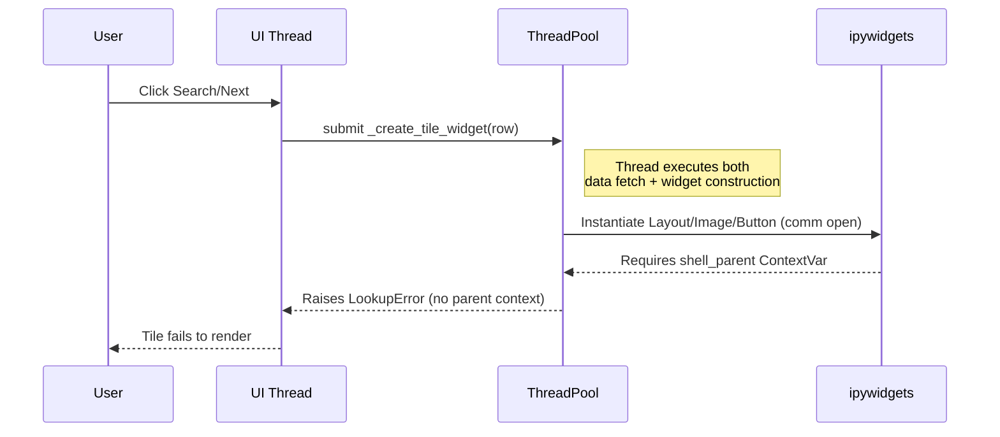
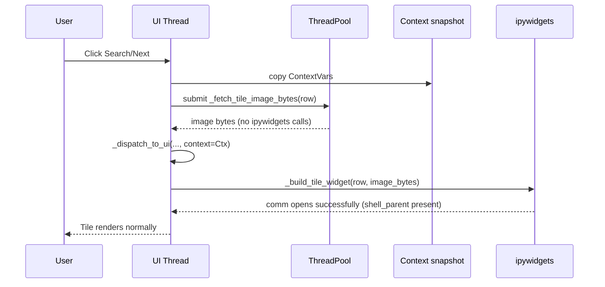
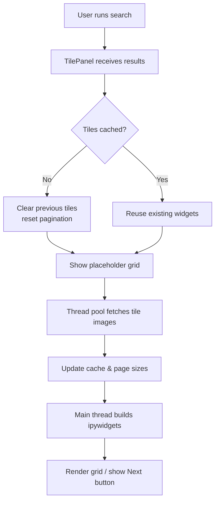

Pre- vs post-fix tile loading
=============================

```mermaid
sequenceDiagram
    participant User
    participant UI as UI Thread
    participant TP as ThreadPool
    participant IW as ipywidgets

    User->>UI: Click Search/Next
    UI->>TP: submit _create_tile_widget(row)
    Note right of TP: Thread executes both<br/>data fetch + widget construction
    TP->>IW: Instantiate Layout/Image/Button (comm open)
    IW-->>TP: Requires shell_parent ContextVar
    TP-->>UI: Raises LookupError (no parent context)
    UI-->>User: Tile fails to render
```

```mermaid
sequenceDiagram
    participant User
    participant UI as UI Thread
    participant TP as ThreadPool
    participant Ctx as Context snapshot
    participant IW as ipywidgets

    User->>UI: Click Search/Next
    UI->>Ctx: copy ContextVars
    UI->>TP: submit _fetch_tile_image_bytes(row)
    TP-->>UI: image bytes (no ipywidgets calls)
    UI->>UI: _dispatch_to_ui(..., context=Ctx)
    UI->>IW: _build_tile_widget(row, image_bytes)
    IW-->>UI: comm opens successfully (shell_parent present)
    UI-->>User: Tile renders normally
```

Overall tile-panel workflow
---------------------------

```mermaid
flowchart TD
    A[User runs search] --> B[TilePanel receives results]
    B --> C{Tiles cached?}
    C -- No --> D[Clear previous tiles\nreset pagination]
    C -- Yes --> E[Reuse existing widgets]
    D --> F[Show placeholder grid]
    E --> F
    F --> G[Thread pool fetches tile images]
    G --> H[Update cache & page sizes]
    H --> I[Main thread builds ipywidgets]
    I --> J[Render grid / show Next button]
```
